# Deliverables
<table>
  <tr>
    <th>CI/CD</th>
    <td><a href="../jenkins/Jenkinsfile">Jenkins Pipeline</a></td>
  </tr>
  <tr>
    <th>Containerization</th>
    <td>
      <ul>
        <li><a href="../docker/docker-compose.yaml">Docker Compose</a></li>
        <li><a href="../application/frontend/Dockerfile">Frontend Dockerfile</a></li>
        <li><a href="../application/backend/Dockerfile">Backend Dockerfile</a></li>
      </ul>
    </td>
  </tr>
  <tr>
    <th>Kubernetes</th>
    <td><a href="../kubernetes/">Kubernetes Manifests</a></td>
  </tr>
</table>


## Architecture Diagram

<p align="center">
  
</p>

___

## GitHub

The project source code is hosted on GitHub using a clean and well-structured branching strategy.

### Repository Structure

#### `main`
- Production-ready branch.
- Always kept stable and clean.
- Contains only tested and approved code.

#### `Dockerfile`
- Dedicated branch for Docker containerization.
- Contains the Dockerfile and related configuration required to build application images.

#### `K8s`
- Dedicated branch for Kubernetes deployment.
- Contains Kubernetes manifests, including:
  - Deployments
  - Services
  - Namespaces
  - ConfigMaps
  - Secrets

___

## Jenkins

The following flowchart provides an overview of the Jenkins CI/CD pipeline workflow.

<p align="center">
  
</p>

For a detailed explanation of the Jenkins pipeline, refer to the [Jenkins README](jenkins/README.md).


### Jenkins Configuration
<table>
  <tr>
    <td align="center">
      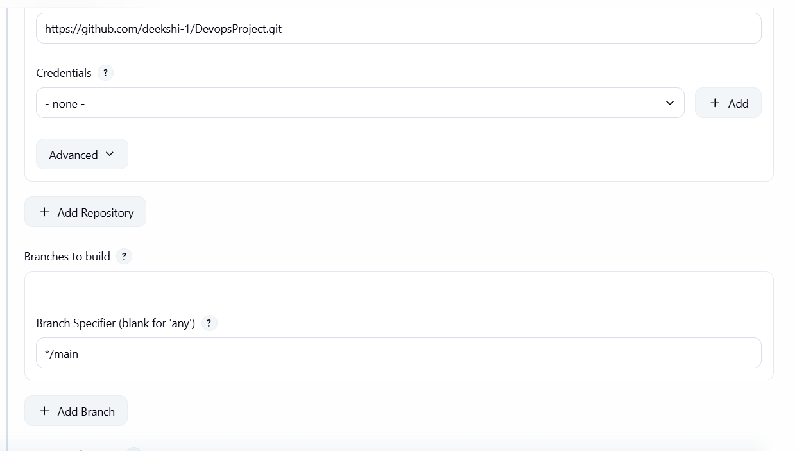
    </td>
    <td align="center">
      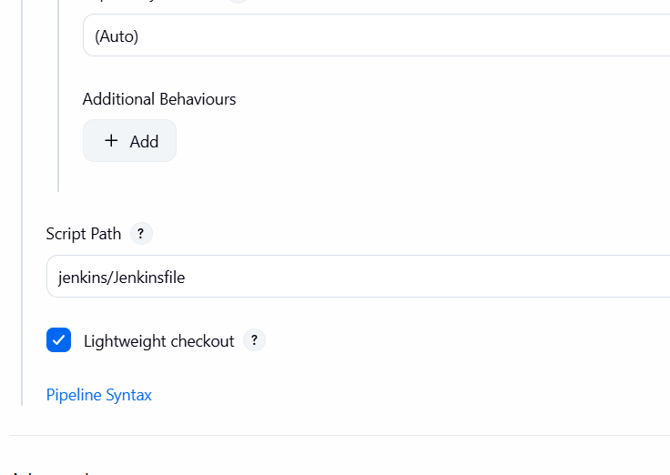
    </td>
  </tr>
</table>

### Project Screenshots

<table>
  <tr>
    <th>Credentials</th>
    <th>Tools</th>
  </tr>
  <tr>
    <td align="center">
      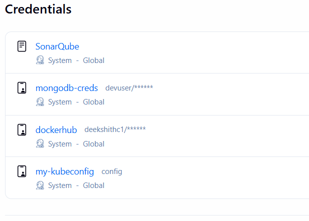
    </td>
    <td align="center">
      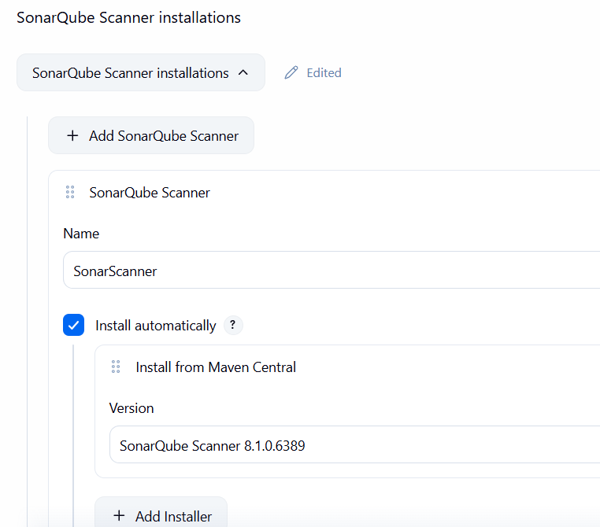
    </td>
  </tr>

  <tr>
    <th>System Settings</th>
    <th>Installed Plugins</th>
  </tr>
  <tr>
    <td align="center">
      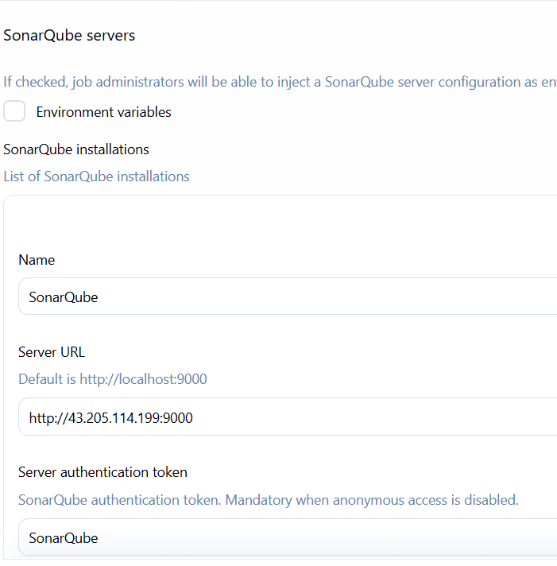
    </td>
    <td>
      <ul>
        <li>Sonar Scanner</li>
        <li>Git</li>
        <li>Docker Pipeline</li>
        <li>Kubernetes CLI Plugin</li>
        <li>Pipeline: Stage View</li>
      </ul>
    </td>
  </tr>
</table>


### Pipeline Configuration

<p align="center">
  
</p>

---
### Webhook

<table>
  <tr>
    <th>Jenkins</th>
    <th>Github</th>
  </tr>
  <tr>
    <td align="center">
      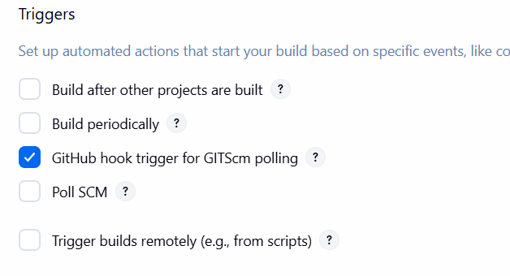
    </td>
    <td align="center">
      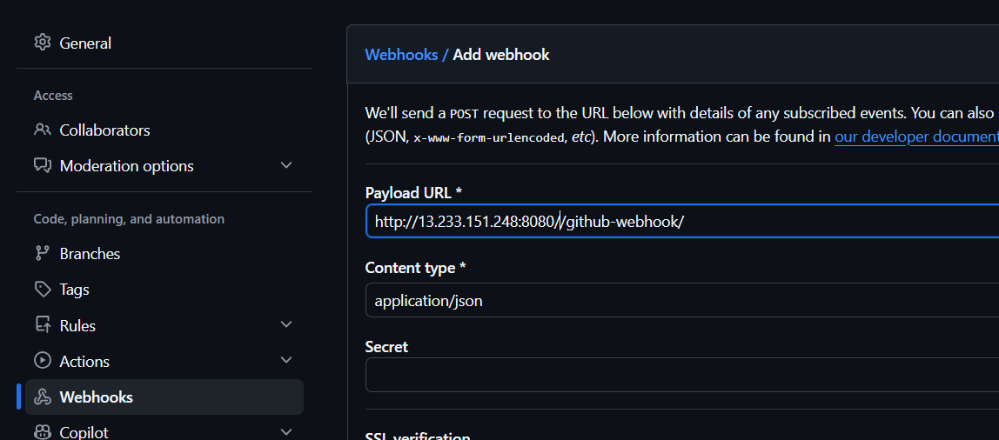
    </td>
  </tr>
</table>  

---

### Pipeline Notifications


The pipeline includes comprehensive post-build actions to handle successful deployments, failures, cleanup, and Microsoft Teams notifications.

#### Success

- Displays a success summary in the Jenkins console.
- Lists the generated frontend and backend Docker images.
- Sends a success notification to the configured Microsoft Teams channel containing:
  - Job name
  - Build number
  - Build status
  - Docker image tags
  - Build URL

#### Failure

- Displays the failure summary.
- Attempts an automatic Kubernetes rollback using the rollback script.
- Reports whether the rollback was successful.
- Sends a failure notification to Microsoft Teams containing:
  - Job name
  - Build number
  - Build status
  - Rollback status
  - Build URL

#### Always

This stage runs regardless of the pipeline result.

- Executes the cleanup script.
- Removes temporary resources.
- Prints the final pipeline status.
- Sends a final notification to Microsoft Teams containing:
  - Job name
  - Build number
  - Final build status
  - Build URL

#### Jenkins `post` Block

```groovy
post {

    success {

        echo """
        =======================================
        Pipeline Completed Successfully

        Frontend Image : ${FRONTEND_IMAGE}:${BUILD_NUMBER}
        Backend Image  : ${BACKEND_IMAGE}:${BUILD_NUMBER}

        Application deployed successfully.
        =======================================
        """

        office365ConnectorSend(
            webhookUrl: "${TEAMS_WEBHOOK}",
            message: """
✅ *Jenkins Pipeline Succeeded*

**Job:** ${env.JOB_NAME}
**Build:** #${env.BUILD_NUMBER}
**Status:** SUCCESS

Frontend Image:
${FRONTEND_IMAGE}:${BUILD_NUMBER}

Backend Image:
${BACKEND_IMAGE}:${BUILD_NUMBER}

Build URL:
${env.BUILD_URL}
"""
        )
    }

    failure {

        echo """
        =======================================
        Pipeline Failed

        Rolling back deployments...
        =======================================
        """

        script {
            try {
                withKubeConfig(credentialsId: 'my-kubeconfig') {
                    sh "bash scripts/k8s-rollback.sh"
                }
                echo "Rollback completed successfully."
            } catch (Exception e) {
                echo "Rollback failed: ${e.getMessage()}"
            }
        }

        office365ConnectorSend(
            webhookUrl: "${TEAMS_WEBHOOK}",
            message: """
❌ *Jenkins Pipeline Failed*

**Job:** ${env.JOB_NAME}
**Build:** #${env.BUILD_NUMBER}
**Status:** FAILURE

Rollback attempted.

Build URL:
${env.BUILD_URL}
"""
        )
    }

    always {

        sh "bash scripts/cleanup.sh"

        echo "Pipeline Finished"

        office365ConnectorSend(
            webhookUrl: "${TEAMS_WEBHOOK}",
            message: """
ℹ️ *Pipeline Finished*

**Job:** ${env.JOB_NAME}
**Build:** #${env.BUILD_NUMBER}

Final Status: ${currentBuild.currentResult}

Build URL:
${env.BUILD_URL}
"""
        )
    }
}
```
<p align="center">
  
</p>

___


## Docker
Docker file explanation

### Dockerfiles

- Frontend: [Dockerfile README](../application/frontend/Docker.md)
- Backend: [Dockerfile README](../application/backend/Docker.md)

### Docker Compose

- [Docker Compose README](../docker/README.md)

<table>
<tr>
    <th>Images</th>
    <th>Containers</th>
  </tr>
  <tr>
    <td align="center">
      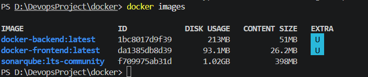
    </td>
    <td align="center">
      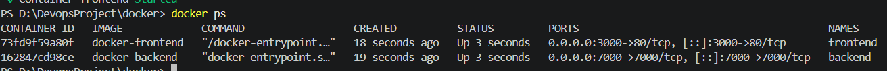
    </td>
  </tr>
</table>

## DockerHub

## SonarQube 
<p align="center">
  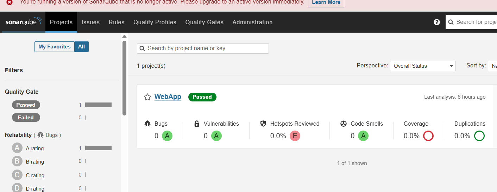
</p>

### Integrating sonarqube with jenkins 
 <table>
<tr>
    <th>Token</th>
    <th>Webhook</th>
  </tr>
  <tr>
    <td align="center">
      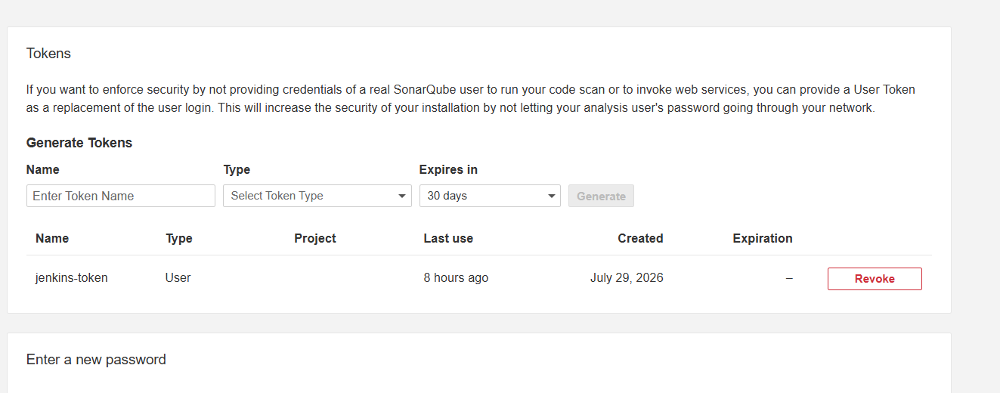
    </td>
    <td align="center">
      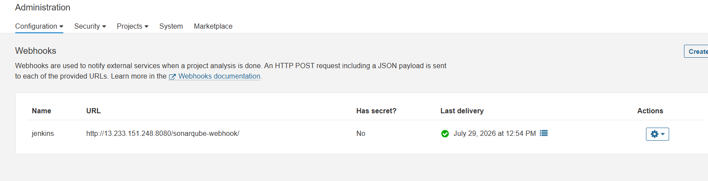
    </td>
  </tr>
  <tr>
    <td>
     <p>Steps</p>
      <ol>
        <li>Administration</li>
        <li>Configuration</li>
        <li>Webhooks</li>
      </ol>
    </td>
    <td>
      <p>Steps</p>
      <ol>
        <li>My Account</li>
        <li>User Token</li>
        <li>Security</li>
        <li>Generate token</li>
      </ol>
    </td>
  </tr>
</table>

---

## Kubernetes

The project is deployed on Kubernetes using separate manifests for the namespace, deployments, services, configuration, secrets, and ingress. This setup provides a scalable, production-ready architecture with rolling updates, health checks, secure configuration management, and external traffic routing.

### Manifest Files
#### `namespace.yaml`
- Creates the dedicated `webapp` namespace to isolate all application resources.

#### `ingress.yaml`
- Configures the NGINX Ingress controller to route `/` requests to the frontend and `/api` requests to the backend.

#### `backend-deployment.yaml`
- Deploys the backend application with multiple replicas, rolling updates, resource limits, health probes, and environment configuration.

#### `backend-service.yaml`
- Exposes the backend internally using a `ClusterIP` service on port `7000`.

#### `backend-configmap.yaml`
- Stores non-sensitive backend configuration values such as the application environment and port.

#### `backend-secret.yaml`
- Creates the backend Secret from environment variables, keeping sensitive data out of source code.

#### `frontend-deployment.yaml`
- Deploys the frontend application with rolling updates, multiple replicas, resource limits, and health checks.

#### `frontend-service.yaml`
- Exposes the frontend application using a `NodePort` service, making it accessible within the cluster and through the ingress.


<p align="center">
  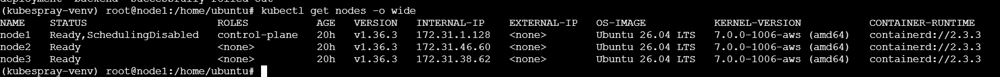
</p>
<p align="center">
  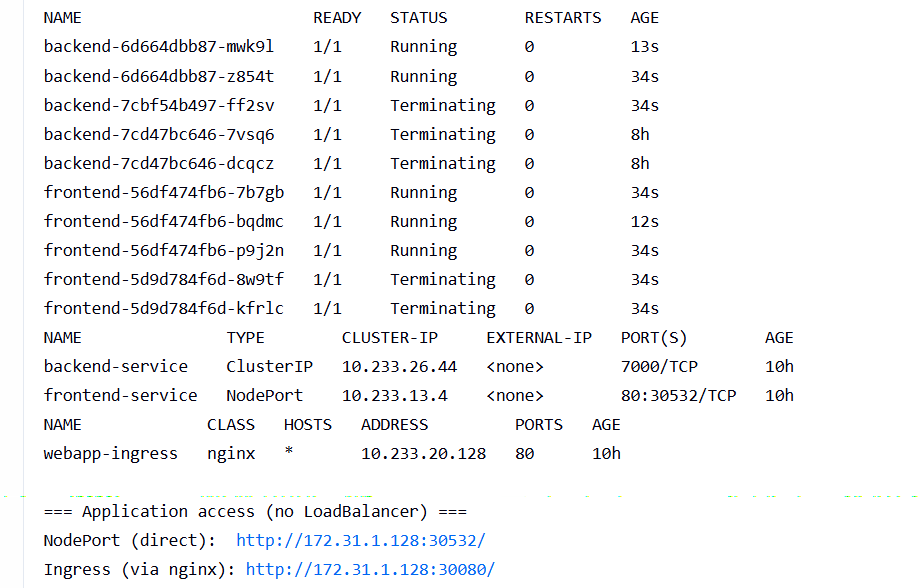
</p>
<p align="center">
  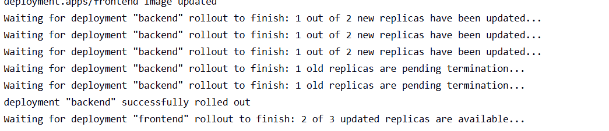
</p>